# Execution Layer : Reth

I went with Reth because I was curious about how rust was used in this context and want to learn more about Rust usage on the blockchain.

Reth (short for Rust Ethereum) is an Ethereum full node implementation that is focused on being user-friendly, highly modular, fast and efficient.

## Build from Source

### Dependencies

### Installing rust

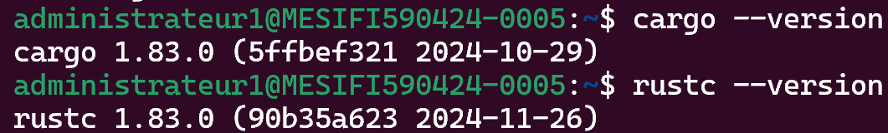

### Installing dependencies

### Build Reth

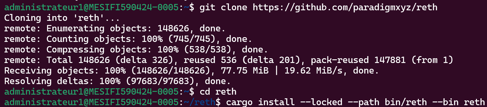

## Run a Node

### Reth full node

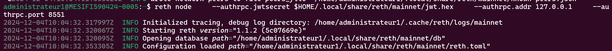

### Start CL (lighthouse)
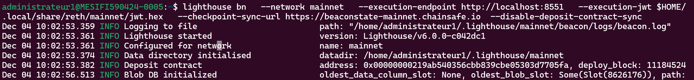

### Verify the chain is growing
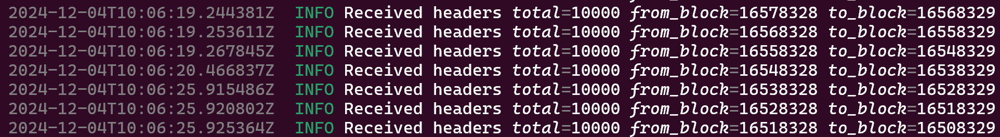

# Consensus Layer : Lighthouse  

I decided to go with Lighthouse because its usage is widely spread and is also built on rust.

Lighthouse is an Ethereum consensus client that connects to other Ethereum consensus clients to form a resilient and decentralized proof-of-stake blockchain.

## Build from source

### Dependencies

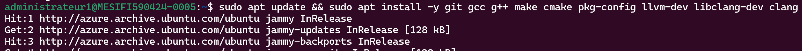

### Build Lighthouse

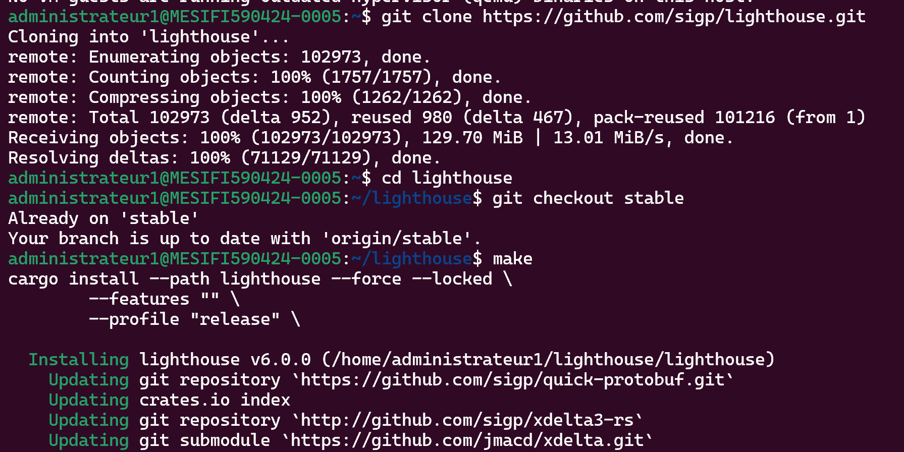
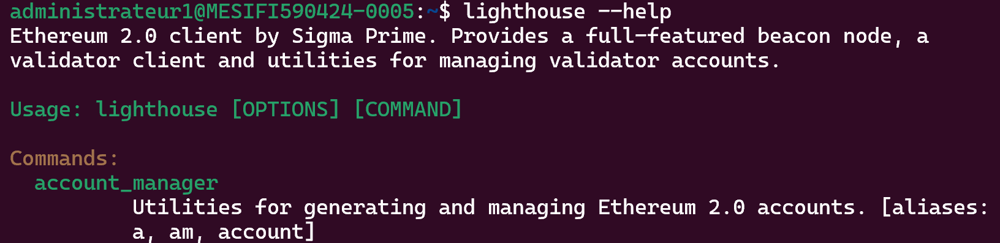

## Set up a beacon node using Lighthouse

### Autogenerated JWT secret file by Reth (EL)
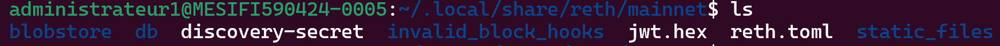

### Start beacon node
Used different HTTP sync URL
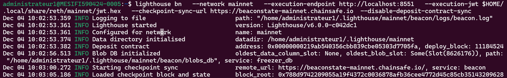

# Create services
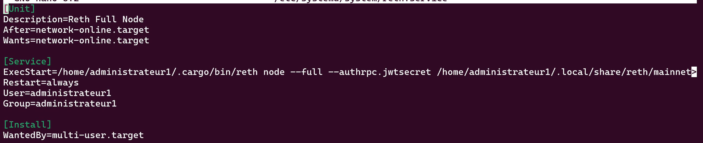
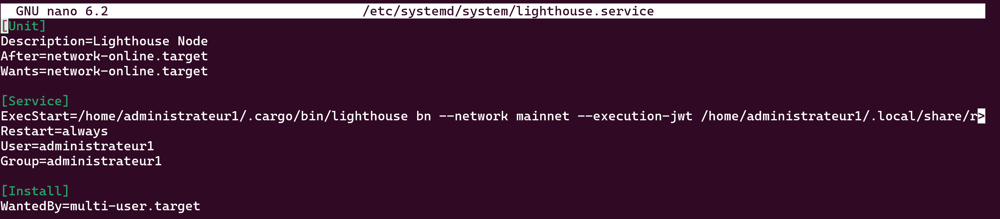
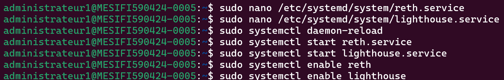
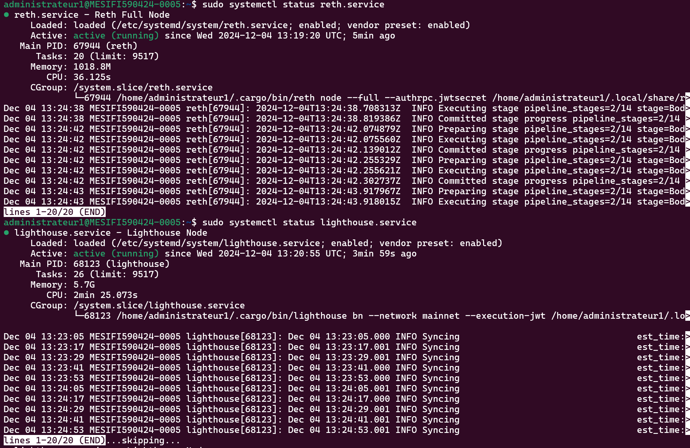

# Monitor Synching
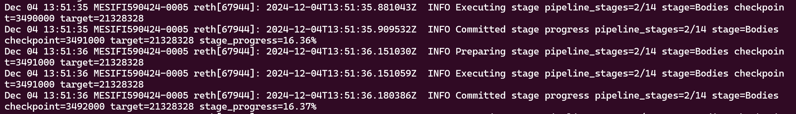

Now we wait for reth to fully synch before calling the JSON RPC API methods

(Work in progress...)